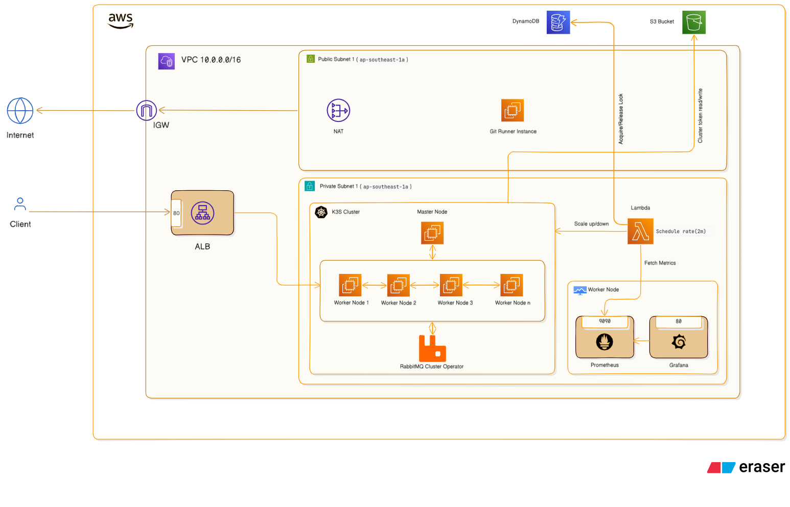

# Kubernetes-Smart-Autoscaler

SmartScale is a production-grade, automated scaling system designed for a high-traffic K3s (Lightweight Kubernetes) cluster on AWS. It solves the critical balance between **cost optimization** (reducing idle waste) and **high availability** (handling traffic surges during flash sales).

## Service Diagram



## Key Features

- **Dynamic Node Scaling:** Lambda-based autoscaler that provisions/deprovisions EC2 worker nodes based on real-time Prometheus metrics.

- **Workload Isolation:** Monitoring stack (Prometheus/Grafana) is isolated to dedicated worker nodes to protect the K3s Control Plane.

- **Event-Driven Scaling:** Microservices (Order, Payment, Inventory) utilize Horizontal Pod Autoscaling (HPA) triggered by traffic and RabbitMQ message processing.

- **Graceful Termination:** Automated node draining and cordoning to ensure zero-downtime during scale-down events.

- **State Management:** DynamoDB-backed locking mechanism to prevent race conditions during scaling operations.

## Technology used

- **Cloud Infrastructure:** AWS (EC2, ASG, Lambda, DynamoDB, S3)

- **Orchestration:** K3s (Lightweight Kubernetes)

- **Infrastructure as Code:** Pulumi (Python)

- **Configuration Management:** Ansible

- **Monitoring:** Prometheus & Grafana

- **CI/CD:** GitHub Actions

- **Messaging:** RabbitMQ (Event-Driven Architecture)


## Infrastructure Setup
### Prerequisites

1. **AWS Account:** With permissions for EC2, Lambda, DynamoDB, and IAM.
2. **Pulumi CLI:** Installed and configured with your AWS credentials.
3. **GitHub Secrets:** Set up the following secrets in your repository:

## Project Structure:
The project is organized into the following structure:
```
.github
└── workflows
    ├── apply-deployments.yml
    ├── autoscaler-deploy.yml
    ├── deploy-lambda.yml
    ├── infra.yml
    ├── k3s-deploy.yml
    └── setup-git-runner.yml
.
├── ansible
│   ├── ansible.cfg
│   ├── inventory
│   │   └── hosts.ini
│   ├── roles
│   │   ├── common
│   │   │   └── tasks
│   │   │       └── main.yml
│   │   ├── k3s-master
│   │   │   └── tasks
│   │   │       └── main.yml
│   │   └── k3s-worker
│   │       └── tasks
│   │           └── main.yml
│   └── site.yml
├── docs
│   └── diagrams
│       └── diagram-export-3-25-2026-1_27_07-PM.png
├── functions
│   └── smart-scaler
│       ├── requirements.txt
│       └── src
│           ├── cluster_config.py
│           ├── __init__.py
│           ├── main.py
│           ├── metrics.py
│           ├── scaler.py
│           └── state_manager.py
├── infra
│   ├── common
│   │   ├── __main__.py
│   │   ├── Pulumi.dev.yaml
│   │   └── Pulumi.yaml
│   ├── k3s-cluster
│   │   ├── master
│   │   │   ├── __main__.py
│   │   │   ├── Pulumi.dev.yaml
│   │   │   └── Pulumi.yaml
│   │   └── worker
│   │       ├── __main__.py
│   │       ├── Pulumi.dev.yaml
│   │       ├── Pulumi.yaml
│   │       └── scripts
│   │           └── join_cluster.sh
│   ├── lambda
│   │   └── autoscaler.py
│   ├── README.md
│   └── requirements.txt
├── k8s-manifests
│   ├── autoscaler
│   │   └── lambda-trigger.yaml
│   ├── helm
│   │   └── ingress-nginx
│   │       ├── values-dev.yaml
│   │       └── values-prod.yaml
│   ├── ingress
│   │   ├── grafana-ingress.yaml
│   │   ├── order-ingress.yaml
│   │   ├── prometheus-ingress.yaml
│   │   └── rabbitmq-ingress.yaml
│   ├── load-testing
│   │   ├── node-stresser.yaml
│   │   ├── pod-hpa-stresser.yaml
│   │   └── script
│   │       └── hpa-stresser.sh
│   ├── Makefile
│   ├── namespace.yaml
│   ├── rabbitmq
│   │   ├── cluster
│   │   │   └── rabbitmq-cluster.yaml
│   │   ├── deployment.yaml
│   │   ├── pdb.yaml
│   │   ├── pvc.yaml
│   │   └── service.yaml
│   ├── services
│   │   ├── inventory
│   │   │   ├── deployment.yaml
│   │   │   ├── hpa.yaml
│   │   │   ├── pdb.yaml
│   │   │   └── service.yaml
│   │   ├── notification
│   │   │   ├── deployment.yaml
│   │   │   ├── hpa.yaml
│   │   │   ├── pdb.yaml
│   │   │   └── service.yaml
│   │   ├── order
│   │   │   ├── deployment.yaml
│   │   │   ├── hpa.yaml
│   │   │   ├── pdb.yaml
│   │   │   └── service.yaml
│   │   └── payment
│   │       ├── deployment.yaml
│   │       ├── hpa.yaml
│   │       ├── pdb.yaml
│   │       └── service.yaml
│   ├── storage
│   │   └── ebs-sc.yaml
│   └── values
│       ├── ingress-nginx.yaml
│       └── prometheus.yaml
└── README.md

```


## Deployment with AWS
The deployment process involves the following steps:

### GitHub Actions:
The following GitHub actions are given in order. They also run in order. But in some cases they don't run automatically. If not then there are a dispatch option too so you can deploy them manually.
1. **infra.yml**: A GitHub Actions workflow is triggered by a push event to the `master` branch and only selected directory which setup necessary AWS infrastructure, also you trigger with the `dispatch`.
2. **setup-git-runner.yml**: Installs `Ansible` to the Git Runner Instance. Must need `GH_PAT` in the GitHub secrets. You can create it from your GitHub profile => `Settings` => `Developer Settings` => `Personal access tokens` => `Fine-grained tokens` => `Generate new Token`
3. **k3s-deploy.yml**: Installs k3s cluster to the Master Node using `Ansible`.
4. **autoscaler-deploy.yml**: This action installs the Auto Scaling Group, Worker Nodes, Lambda, DynamoDB, and Worker Nodes joins the cluster dynamically.
5. **apply-deployments**: This action file applies all manifests including deployment, ingress, services, rabbitmq cluster to the k3s cluster. Also installs Prometheus and Grafana using `Helm`.
6. **deploy-lambda**: It updated the lambda function if any update pushed in the `functions` directory. Ignore it in the first load. 

### Deployment Process
Set up the following environment variables in GitHub into your repository. Go to the repository `settings` => `Secrets and variables` => Click `Actions` => Click `New repository secret`
```
AWS_ACCESS_KEY_ID
AWS_SECRET_ACCESS_KEY
ENVIRONMENT
GRAFANA_PASSWORD
PROMETHEUS_PASSWORD
PUBLIC_KEY
PULUMI_ACCESS_TOKEN
RABBITMQ_DEFAULT_PASS
RABBITMQ_DEFAULT_USER
RABBITMQ_HOST
RABBITMQ_PORT
SSH_PRIVATE_KEY
```
**Note**: If you add `ENVIRONMENT == development` all app services will be installed in the `development` namespace

### Configure secrets
1. Generate SSH Keys Locally:

    Generate a new SSH key pair on your local machine. This key pair will be used to SSH into the EC2 instances.

    ```
    ssh-keygen -t ed25519 -C "default"
    ```
    This will generate two files, typically in the ~/.ssh directory:

   - `id_ed25519` (private key)
   - `id_ed25519.pub` (public key)

2. Save the Public Key to the GitHub secret:

    Navigate to the .ssh directory where the keys were generated.
    ```
    cd ~/.ssh
    ```
    - Get the Public Key and Add It to GitHub Secrets variable `PUBLIC_KEY` .
    - Open the id_ed25519.pub file and copy its contents.
    ```
    cat id_ed25519.pub
    ```
    - Open the id_ed25519 file and copy its contents and Add it to GitHub Secrets variable `SSH_PRIVATE_KEY`.
    ```
    cat id_ed25519
    ```
    

### Deploy Kubernetes Autoscaler:
Once you finish with setting the secret variables, you can push the code to the `master` branch, the GitHub Actions will
Automatically install the autoscaler in AWS. You also trigger the workflows with the `dispatch` option.
The Workflows will handle all of the installation processes.

### Note: You need to verify every workflow files ran successfully.
- [x] infra.yml needs ✅
- [x] setup-git-runner.yml needs ✅
- [x] k3s-deploy.yml needs ✅
- [x] autoscaler-deploy.yml needs ✅
- [x] apply-deployments.yml needs ✅


## Verification
1. Check GitHub Actions logs.
2. After successful completion of the workflows, we can SSH into the Git-runner instance.
   - Open an Ubuntu terminal
   - Convert the private key into a pem file.
   - Run the following command to SSH into the Git-runner instance
      ```
      ssh -i ~/.ssh/my-key-pair.pem ubuntu@<git-runner-public-ip>
      ```
3. Now you are in the Git-runner instance. SSH into Master node instance
   - In the GitHub action we copied the pem file to the Public instance in ~/.ssh directory of the Git runner instance. Using this pem file, we can ssh into Master node. Run this command.
       ```
        ssh -i ~/.ssh/my-key-pair.pem ubuntu@<master-node-private-ip>
       ```
   - Now you are in the Master node. Run this command to check if k3s is installed and working correctly
     ```
     kubectl get nodes
     ```
     here you can see the Master node and the worker node has been deployed successfully and in ready state
4. Check running pods.
   - Check running pods in the namespace=ENVIRONMENT you provided in the GitHub secrets.
   - Suppose I provided `ENVIRONMENT=development`. Then to get the running pods, we will run -
      ```
      kubectl get pods -n development
      ```
     
### Visit the Monitoring tools
The workflows will automatically install the monitoring tools like Prometheus, Grafana, and Rabbitmq Management Tools.

1. To visit them first you need to visit the Application Load Balancer from the AWS console.
2. Copy the ALB DNS address.
3. Then paste the ALB DNS address into the browser with following format
   - **Prometheus:** <ALB-DNS-ADDRESS>/prometheus
   - **Grafana:** <ALB-DNS-ADDRESS>/grafana
   - **RabbitMQ Management:** <ALB-DNS-ADDRESS>/rabbitmq/
4. You need to provide your passwords you set in the GitHub Secrets of your repo to access them.
     
### Load Testing
To verify the scaling logic, use the provided stresser scripts in `k8s-manifests/load-testing/`

1. Both Horizontal Pod Autoscaling and Node level Autoscaling applied.
2. You can copy them into your master node and run the following commands.
   - Test worker node auto scaling:
    ```
    kubectl apply -f node-stresser.yaml
    ```
   - Test horizontal pod autoscaling:
   ```
    kubectl apply -f pod-hpa-stresser.yaml
    ```
3. Visit Lambda in AWS console and go to the monitoring tab. You will see the scale up and down logs.

## High-Level Design (HLD)
For a deep dive into the system architecture, data flow, and networking topology, please refer to the **Detailed HLD Documentation** located in the docs/ directory.
(**Note:** HLD diagrams and architectural deep-dives are soon uploaded in the docs/ path.)

## Conclusion
The **SmartScale K3s Autoscaler** effectively addresses the "Scale-Out vs. Cost" dilemma faced by modern startups. By moving away from a fixed 5-node setup to a dynamic, metric-driven architecture, this project achieves:

1. **Efficiency:** Reduces monthly infrastructure costs by up to 30-40% by scaling down to a 2-node minimum during off-peak hours (9 PM - 9 AM).

2. **Resilience:** Eliminates manual scaling delays (15-20 mins) by responding to traffic surges in under 3 minutes, preventing the service crashes experienced during previous flash sales.

3. **Reliability:** Uses a specialized Lambda-based drain logic to ensure that instances are only terminated after workloads have safely migrated, maintaining a seamless user experience.

This system provides a production-grade blueprint for managing lightweight Kubernetes clusters with enterprise-level scaling requirements.